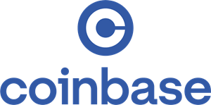

# FinTech Case Study: Blockchain & Cryptocurrencies - Coinbase Global, Inc.

By **Krishan Kandial**

September 7, 2021

## Overview and Origin

This case study is on the **Blockchain and Cryptocurrencies** FinTech domain with a focus on **Coinbase Global, Inc** (Coinbase). The company was founded on June 20, 2012, by Brian Armstrong and Fred Ehrsam [^1]. Coinbase was founded on the idea that anyone, anywhere, should be able to easily and securely send and receive Bitcoin [^2]. Coinbase was initially funded by a round of Series investment from various investors, to name a few:
* Pegasus Tech Ventures
* Paradigm
* Proioxis Ventures Fund
* True Capital Management
* Fundamental Labs
* Chainfund Capital
* Manhattan Ventures Partners 
* Next Play Capital
* K2 Global
From the company's latest funding in October 2020 they have raised a total of $547.3M. On April 14, 2021, Coinbase went public with an Initial Public Offering (IPO), the opening price per share was $381.00 [^3].

## Business Activities:

Coinbase's mission is to create an open financial system for the world and to be the leading global brand for helping people convert digital currency into and out of their local currency [^4]. 

The company’s intended customer is the world population. Based on the company’s website to date they have over 68 million verified users in 100+ countries [^2]. 

They have an easier user interface which is more suitable for beginners and non-technical persons to start trading cryptocurrencies [^5]. By making the interface usable it attracts more customers and encourages the use of blockchain and cryptocurrency technology. 

* Which technologies are they currently using, and how are they implementing them? (This may take a little bit of sleuthing–– you may want to search the company’s engineering blog or use sites like Stackshare to find this information.)

## Landscape:

Coinbase is within the Blockchain and Cryptocurrencies domain of the Fintech industry.

* What have been the major trends and innovations of this domain over the last 5-10 years?

* What are the other major companies in this domain?

## Results

* What has been the business impact of this company so far?

* What are some of the core metrics that companies in this domain use to measure success? How is your company performing, based on these metrics?

* How is your company performing relative to competitors in the same domain?

## Recommendations

* If you were to advise the company, what products or services would you suggest they offer? (This could be something that a competitor offers, or use your imagination!)

* Why do you think that offering this product or service would benefit the company?

* What technologies would this additional product or service utilize?

* Why are these technologies appropriate for your solution?

[^1] https://en.m.wikipedia.org/wiki/Coinbase
[^2] https://www.coinbase.com/about 
[^3] https://www.crunchbase.com/organization/coinbase/company_financials 
[^4] https://help.coinbase.com/en/coinbase/getting-started/crypto-education/what-is-coinbase 
[^5] https://www.businessinsider.com/personal-finance/binance-vs-coinbase